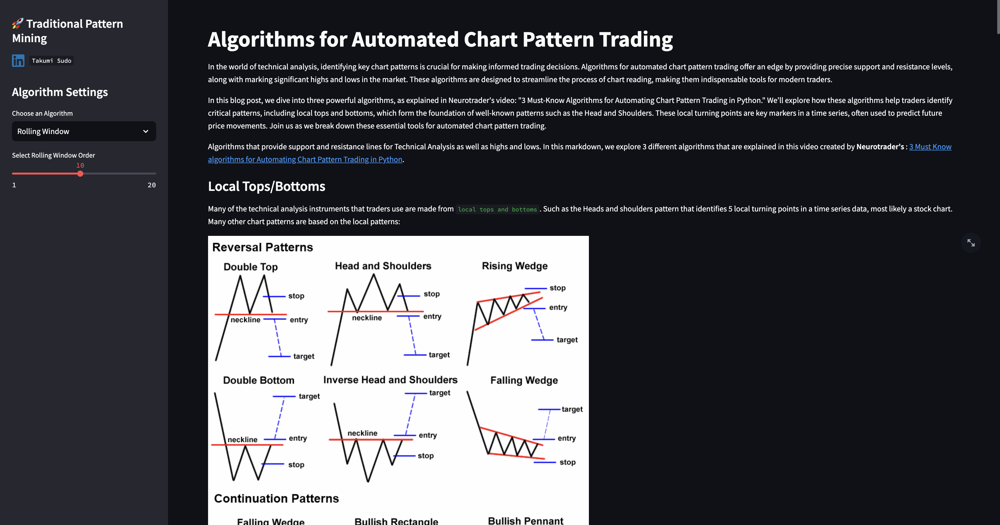
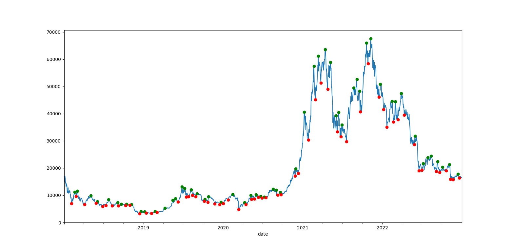

## Automated Chart Pattern Trading Application - README



## LINK : (https://takumisudo-chart-patterns-st-streamlit-chart-patterns-7skgpw.streamlit.app/)

### Overview

This Streamlit application provides powerful algorithms for identifying chart patterns in stock price data. It automates the detection of key technical analysis features like support and resistance levels, local tops and bottoms, and high/low points, offering traders the ability to make data-driven decisions with minimal manual intervention.

The application incorporates three essential algorithms as described in Neurotrader's video, *"3 Must-Know Algorithms for Automating Chart Pattern Trading in Python,"* to simplify the process of analyzing and interpreting stock charts.

Some of the application that can be shown in the applications are the following:

### Example of Rolling Window Calculated for BTC


A rolling window in trading pattern fundamental analysis continuously updates calculations using a fixed-size subset of the most recent data points. It helps track trends and patterns by focusing on the latest market movements while discarding older data. This method is often used for calculating moving averages, volatility, or momentum, providing real-time insight into price behavior. By using a rolling window, traders can react to changes more dynamically, making adjustments based on the most current market conditions.


### Features

- **Local Tops and Bottoms Detection**: Identifies the local high and low points in time series data, which form the foundation for patterns like Head and Shoulders.
  
- **Support and Resistance Levels**: Automatically draws support and resistance lines based on historical price movements, allowing traders to see potential breakout or reversal points.
  
- **Dynamic Chart Visualization**: Visualizes stock data, including the automatically identified support/resistance levels and local turning points, giving traders an easy-to-read representation of price action.

- **User-Friendly Interface**: Built on Streamlit, the application provides an interactive, real-time interface for traders to upload data, configure parameters, and visualize the patterns.

### How to Use

1. **Install Dependencies**  
   Ensure you have Python and pip installed. Then, run the following command to install the necessary dependencies:
   
   ```bash
   pip install -r requirements.txt
   ```

2. **Run the Application**  
   Start the Streamlit app with the following command:
   
   ```bash
   streamlit run app.py
   ```

3. **Upload Stock Data**  
   The app allows users to upload CSV files containing stock price data. The file should include columns for date, open, high, low, close, and volume.

4. **Visualize and Analyze**  
   Once data is uploaded, the application will process it using the built-in algorithms. Users can view charts that show support and resistance lines, as well as local tops and bottoms in the stock data.

### Requirements

- Python 3.x
- Streamlit
- Pandas
- Matplotlib
- NumPy
